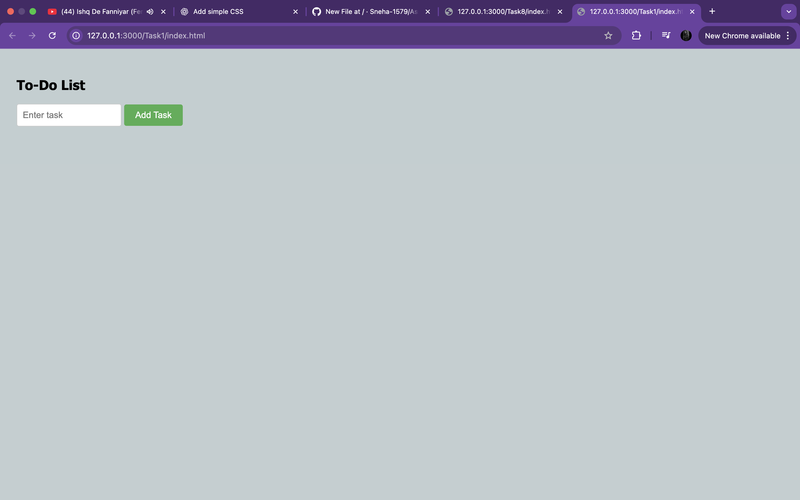
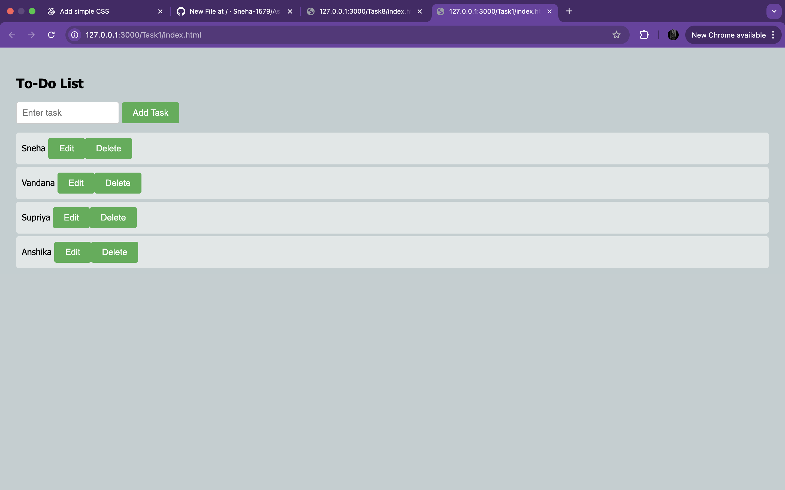
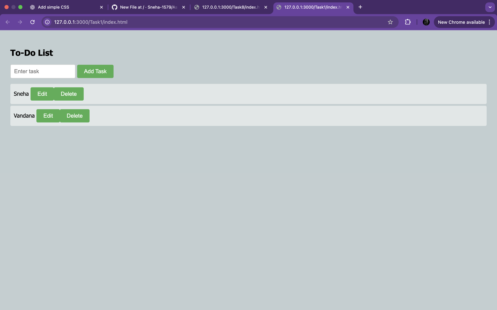
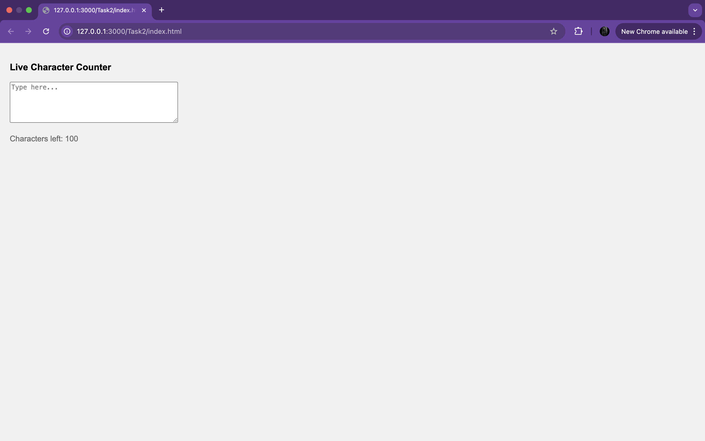
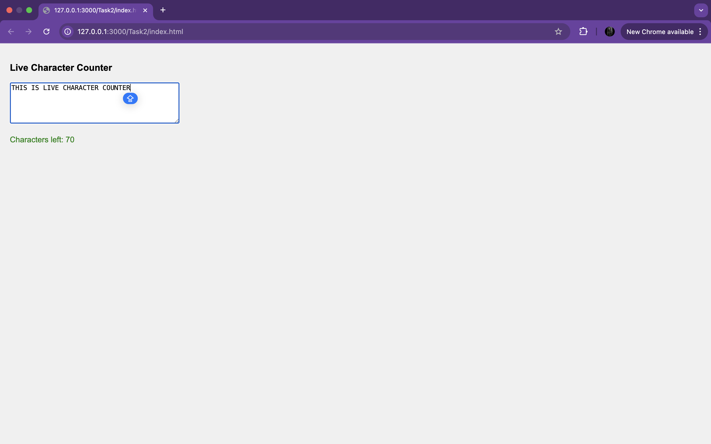

<h1>Task 1 : TO DO LIST</h1>

  

<h1>Task 1 : CHARACTER COUNTER</h1>

  

<h1>Task 1 : TO DO LIST</h1>

  

<h1>Task 1 : TO DO LIST</h1>

  

<h1>Task 1 : TO DO LIST</h1>

  

<h1>Task 1 : TO DO LIST</h1>

  

<h1>Task 1 : TO DO LIST</h1>

  

<h1>Task 1 : TO DO LIST</h1>

  

<h1>Task 1 : TO DO LIST</h1>

  

