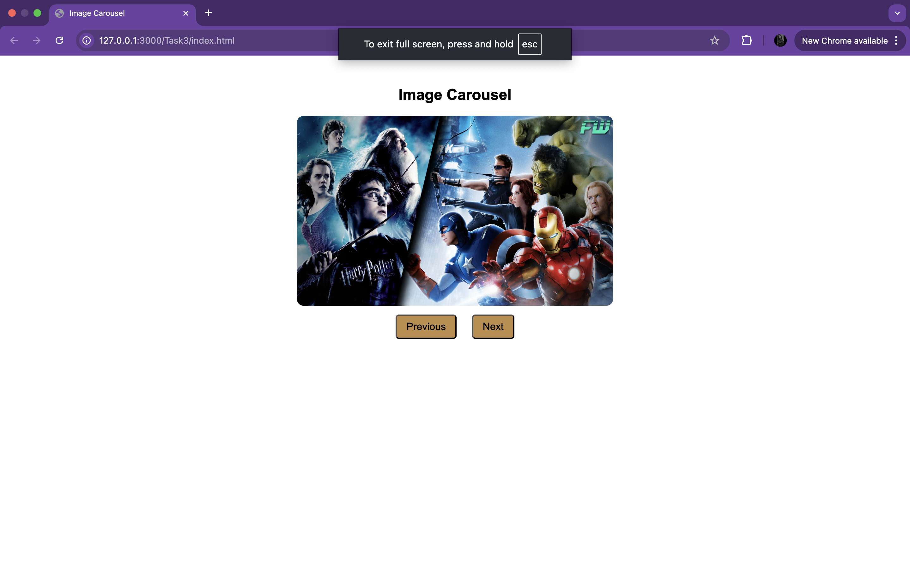

<h1>Task 1 : TO DO LIST</h1>

  

<h1>Task 2 : CHARACTER COUNTER</h1>

  

<h1>Task 3 : IMAGE CAROUSEL</h1>

  

<h1>Task 4 : FROM VALIDATION</h1>

  

<h1>Task 1 : TO DO LIST</h1>

  

<h1>Task 1 : TO DO LIST</h1>

  

<h1>Task 1 : TO DO LIST</h1>

  

<h1>Task 1 : TO DO LIST</h1>

  

